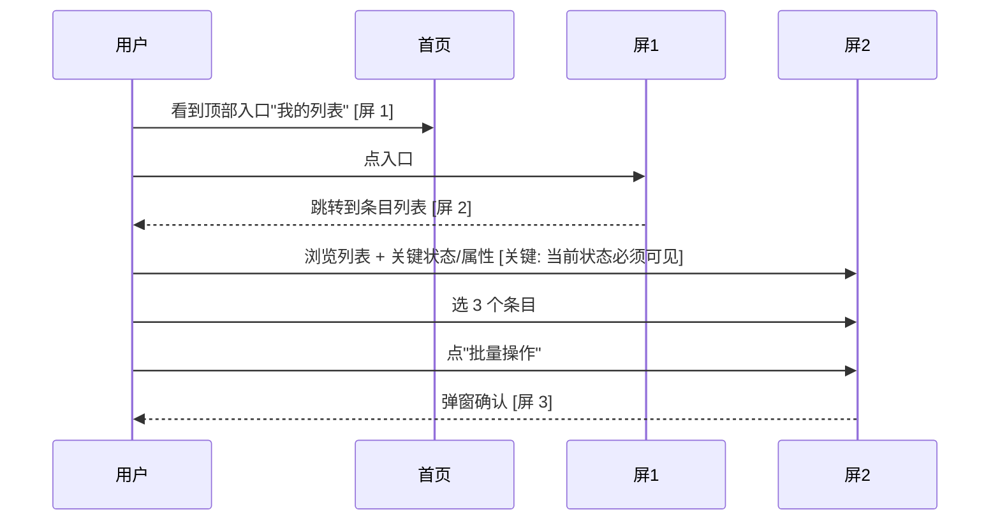

# 🎨 界面设计

> 内部编号：Phase 5（含原 Phase 5a + 5b 合并）
> 内部分两步：① UX 用户视角 wireframe → ② UI 工程视角技术 spec
> 模式：🤖 Autonomous + GAN

## 目标

把 PRD + 用户研究 + 大架构 整合成**前端工程师可直接消费的完整界面方案**：

- **§1 UX 用户视角**：用户旅程 + 信息架构 + 低保真线框（PM 看图）
- **§2 UI 工程视角**：组件清单 + 设计 tokens + 状态机 + 无障碍 + 响应式（前端工程师消费）

**核心原则**：先用户视角后工程视角。UX 决定不被组件选型决定覆盖。两个视角分开是为了让"用户设计决定"不被"组件选型决定"覆盖。

## 触发条件

**仅当 PRD 涉及前端界面**时启用（关键词：页面 / 界面 / 弹窗 / 表单 / 列表 / 编辑器 / 用户操作 / 交互 / UI / UX）。

若不涉及界面 → 跳过本 phase，直接进 Phase 5.9（压缩）。

## 输入

**§1 UX 的输入**：
- `iteration-vault/02-PRD.md`（特别是 user story + 用户旅程段）
- `iteration-vault/01.5-user-research.md`（**关键**：3 个用户画像 + 当前用户旅程图 + 用户心智隐形信息）
- `iteration-vault/04-architecture-and-api.md` §1 大架构（数据模型 → 知道哪些字段要在界面体现）
- 项目现有 DESIGN.md / 设计语言文档（如有）
- 项目定位文档（如有，无则跳过；universal 版无内置业务哲学，可由项目自定）（**重点**：用户心智隐形信息——错误提示文案、loading 反馈；（仅 AI 原生项目）置信度可视化）

**§2 UI Spec 的输入**：
- §1 产出（必读）
- `iteration-vault/04-architecture-and-api.md` §1.3 技术选型（前端框架 + 状态管理）
- 项目现有设计 tokens / 组件库 / 风格指南

---

## 第 1 步：UX 用户视角设计

### 1.1 从 01.5 文件画"用户旅程 with UI 节点"

把 01.5 的"加入新功能后的用户旅程"图升级：在每个用户动作节点旁，标注**这一步用户在哪一屏、看到什么、能点什么**。

输出 `iteration-vault/05-user-journey-annotated.md`：

````markdown
## 标注后用户旅程



涉及屏幕：[屏 1, 屏 2, 屏 3]
关键交互：[标注每一处用户最在意的微交互]
> 上面是业务无关的占位示例（通用「用户 → 列表页 → 详情/批量操作」流）；按实际功能替换角色与动作，重点是示范如何画 UX 线框的节点与关键交互标注。
````

### 1.2 信息架构（IA）梳理

回答：用户脑子里期待的结构是什么？

- 入口（用户从哪点进来）
- 主要分类（用户脑子里的分组方式 vs 我们 schema 的分组方式 → 找差异）
- 状态切换（用户在不同状态间怎么走）
- 错误/空/加载态（用户卡住时要怎么救他）

输出 `iteration-vault/05-information-architecture.md`：树状结构 + 状态机文字描述。

**关键自检**：信息架构 vs 数据 schema 是不是 1:1？如果 1:1，说明我们让用户被迫学习数据库结构（**反模式**）。要让 IA 贴近用户心智，不贴近 schema。

### 1.3 用 Figma MCP 出低保真线框

调 Figma MCP（本机已装，17 个工具）。前置 prompt：
```
基于 05-user-journey-annotated.md 中标注的 [N] 个屏，给我每个屏的低保真 wireframe：
- 灰度（不要颜色，避免 PM 纠结视觉细节）
- 只有方框 + 文字标签 + 主要按钮
- 标注每个区域是什么（如"这里放条目列表"）
- 标注关键交互（"点这个按钮 → 弹这个窗"）

涉及屏：[屏 1 简述, 屏 2 简述, 屏 3 简述]

设计约束（项目特定）：
- （仅 AI 原生项目）必须显性显示 AI 置信度（用户心智隐形信息：用户对 AI 的真实期待）；非 AI 项目跳过此条
- （仅 AI 原生项目）必须有"人工介入"入口（人工保留点）；非 AI 项目跳过此条
- 错误提示要解释"为什么+怎么办"，不只是 error code（通用，所有项目均适用）
```

Figma MCP 输出：低保真 PNG / Figma URL。

把 PNG 保存到 `iteration-vault/05-wireframes/` 目录。

### 1.4 可用性原则自检（Nielsen 10 条 heuristics）

按 Nielsen 10 条可用性原则逐条检查（简化版，UI 工作不是 UX 学位课）：

1. **系统状态可见** — 用户随时知道现在系统在干什么（loading? 成功? 出错?）
2. **匹配真实世界** — 术语用用户的词，不用工程师的词
3. **用户可控** — 撤销 / 退出 / 后退 都要有
4. **一致性** — 同类操作放同位置、用同图标
5. **错误预防** — 危险操作要确认，输入要校验
6. **认得比记得好** — 选项要列出来，不要让用户记
7. **快捷高效** — 高频路径要短，老用户可以 shortcut
8. **简洁** — 屏上只放本屏要的信息
9. **错误恢复** — 错了要告诉用户"为什么 + 怎么办"
10. **帮助文档** — 复杂功能要有"这是干啥"的入口

每条标 ✅ / 🟡 / ❌ + 备注。任何 ❌ → 回 §1.3 调整 wireframe。

### 1.5 用户心智隐形信息检查

回看 01.5 文件的"用户心智隐形信息"段：

- "用户没说但在意"的点 → 是否在 wireframe 中体现？（通用）
- "用户上次不爽场景" → 新设计是否避免了这个场景？（通用）
- （仅 AI 原生项目；非 AI 项目可填 N/A 或跳过）"用户对 AI 的真实期待" → 置信度/可控性是否可视化？

任一答"否" → 修 wireframe。

---

## 第 2 步：UI 工程技术 spec

### 2.1 调 /autodev-ui 出技术 spec

触发：`/autodev-ui <feature-name>`。

前置 prompt：
```
基于 iteration-vault/05-interface-design.md §1 UX 段和 05-wireframes/ 中的 [N] 个屏，
出前端可直接参考的 UI 技术 spec：

1. 页面路由（path / 入口 / 权限）
2. 每个屏的状态机（loading / 数据态 / 空态 / 错误态）
3. 组件树（按 §1 wireframe 的方框结构，给出组件名 + props 接口）
4. 设计 tokens 引用（颜色 / 字号 / 间距 — 优先复用项目现有 tokens）
5. 交互细节（动效、过渡、反馈）
6. 网络状态（loading 时长预期、超时处理、重试策略）

技术栈约束：见 04-architecture-and-api.md §1.3 技术选型
设计约束：（仅 AI 原生项目）必须显性显示 AI 置信度（参考 §1 文档中用户心智隐形信息检查）；非 AI 项目跳过此条
```

### 2.2 组件清单 & 设计 tokens 表

明确标注：
- 每个组件是**新增**还是**复用现有**
- 每个 token 是**新加**还是**复用项目现有**

输出表格（强制结构）：

| 组件 | 新增/复用 | 用途 | Props 接口 | 备注 |
|---|---|---|---|---|
| ListItemCard | 新增 | 屏 2 条目卡片 | item, onSelect | 通用列表项 |
| AIRecommendationCard | 新增 | 屏 2 推荐项卡片 | item, confidence, onSelect | （仅 AI 原生项目）含置信度可视；非 AI 项目无需此组件 |
| Button | 复用 | 通用 | shadcn/ui 默认 | - |

| Token | 类型 | 值 | 新增/复用 |
|---|---|---|---|
| color-confidence-high | 颜色 | #10B981 | （仅 AI 原生项目）新增；非 AI 项目无需置信度色板 |
| color-text-primary | 颜色 | var(--text-primary) | 复用 |

### 2.3 无障碍 + 响应式 + 国际化检查

**WCAG 2.1 AA 必查**：
- [ ] 色彩对比度 ≥ 4.5:1（正文）/ 3:1（大字号）
- [ ] 键盘可达：所有交互可 Tab 到 + Enter 触发
- [ ] 屏幕阅读器标签：图标按钮带 aria-label
- [ ] 焦点可见：focus ring 不被 css 覆盖

**响应式断点**：
- PC（≥ 1280px）：[布局]
- 平板（768-1279）：[布局]
- 手机（< 768）：[布局]
- 关键决定：是否需要专门手机版？还是响应式自适应？

**国际化预留**（项目未来可能要做国际化）：
- 文字长度伸缩 30% 的兼容空间
- 货币 / 日期 / 数字格式抽离

### 2.4 与 §1 UX 的可追溯性校验（关键）

逐条对照 §1 的"用户旅程标注"和"可用性自检"，确保 §2 没有偷偷丢东西：

| §1 决定 | §2 是否落地 | 落地位置 |
|---|---|---|
| 屏 2 显性显示置信度（仅 AI 原生项目） | ✅ | AIRecommendationCard 组件的 confidence prop |
| 错误提示带"为什么+怎么办" | ✅ | ErrorBoundary 组件 + 文案库 |
| 用户上次不爽场景已避免 | ✅ | 屏 1 加了"撤销"入口 |

任何 §1 决定在 §2 里没落地 → 必须有理由（写 autonomous-decisions.md），不能默默丢。

---

## 完整产出

主文件 + 衍生：
- `iteration-vault/05-interface-design.md` — 主文档（§1 UX + §2 UI Spec）
- `iteration-vault/05-user-journey-annotated.md` — 用户旅程标注
- `iteration-vault/05-information-architecture.md` — IA + 状态机
- `iteration-vault/05-wireframes/` — PNG 序列
- `iteration-vault/05-gan/` — GAN trace

### 主文档结构

```markdown
# 界面设计: <feature-name>

## 1. UX 用户视角
### 1.1 涉及屏幕列表
### 1.2 用户旅程标注（见 05-user-journey-annotated.md）
### 1.3 信息架构（见 05-information-architecture.md）
### 1.4 低保真 wireframes（见 05-wireframes/）
### 1.5 Nielsen 10 可用性自检
### 1.6 用户心智隐形信息检查

## 2. UI 工程技术 spec
### 2.1 页面 & 路由
### 2.2 状态机（每个屏）
### 2.3 组件清单
### 2.4 设计 tokens
### 2.5 交互细节
### 2.6 无障碍 + 响应式 + 国际化
### 2.7 §1 → §2 可追溯性校验

## 3. 关键设计决定（autonomous-decisions.md 留痕）
- 为什么选 X 不选 Y（组件库）：
- 为什么不做手机专版：
- §1 哪些决定降级了 + 理由：
```

### 对 PM 的摘要

```
🎨 界面设计完成（iteration-vault/05-interface-design.md）：

【UX】
- 涉及 [N] 个屏，[M] 个关键交互
- 用户旅程：[1 句话简述]
- Nielsen 10 自检：[X/10 通过]
- 用户心智隐形信息：[✅/🟡]

【UI Spec】
- 新增组件：[N] 个，复用 [M] 个
- 新增 tokens：[N] 个
- §1 → §2 可追溯性：[X/Y 决定落地，[Z] 项降级]
- WCAG 2.1 AA：[✅/🟡]

关键关注：[最值得 PM 知道的一条]
```

---

## 🤖 Autonomous 决策规则

- **Figma MCP 不可用** → 降级到 ASCII / Mermaid 文字 wireframe，autonomous-decisions.md 标降级
- **可用性自检 < 7/10 ❌** → 回 §1.3 重画 wireframe，最多重试 2 次
- **PM 在线时主动喊"线框图看着不对"** → 立即暂停 autonomous，进入对话调整模式
- **wireframe 牵涉到品牌 / 视觉语言重大变更** → 触发 R1-like escalation
- **/autodev-ui 输出与 §1 偏离** → 重跑一次，前置 prompt 加强"必须忠于 §1 决定"
- **shadcn/ui 没有合适组件** → 优先用 Tailwind 直接写，避免引入第三方库（除非已批准）
- **WCAG AA 自检 < 100%** → 修到 100% 才进 Phase 5.9，不允许带 ♿ 缺陷进实施

---

## 与其他 phase 的接口

**上游**：
- Phase 4 🏗️ 架构与接口设计 §1 大架构（数据模型）
- Phase 1.5 👥 用户研究（用户画像 + 心智隐形）

**下游**：
- Phase 4 §2 API 设计（**关键**：API 反推需要本 phase §1 UX 输出 → 形成双向迭代）
- Phase 5.9 📚 设计压缩（INDEX + RULES 从本 phase 抽提）
- Phase 6 📋 任务拆解（前端任务按本 phase §2 组件清单拆）
- Phase 7 ⌨️ 代码实施（前端 subagent 直接读本 phase §2 出代码）
- Phase 10 🛡️ 上线前质量检查（§2 状态机直接成为 e2e 测试覆盖目标）

---

## 失败回退

| 失败 | 兜底 |
|---|---|
| PM 是视觉敏感型，要求看真实视觉稿 | 直接进 §2 出高保真，但保留 §1 文档作为"设计意图说明" |
| wireframe 复杂到 Figma MCP 跑不动 | 降级为 mermaid 状态图 + ASCII 框图 |
| 项目暂无 DESIGN.md | 用 Material Design / Ant Design / shadcn 之一作为默认 base，留痕 |
| §1 wireframe 缺失关键节点 | 回 §1 补，不在 §2 自己脑补 |
| /autodev-ui 输出技术细节空洞 | 降级为手工补 spec，标降级 |
| 设计 tokens 数量爆炸（新增 > 现有 50%） | 重审是不是过度个性化，回 §1 看是不是 UX 思路不对 |
| PM 看完 §2 想改 §1 | 重跑 §1，§2 等 |

---

## 维护备忘

- 每跑完一次本 phase，把"哪类目标客户对 UX 最敏感"经验沉淀到本文件末尾
- 如果项目团队建立了正式的 DESIGN.md / 设计系统，§1.3 的 Figma MCP 调用要前置喂入设计 tokens
- 新增的稳定组件沉淀到项目设计系统
- Nielsen 10 太长可以简化为本 phase 高频用的 5 条（按目标客户群特点定）
- WCAG 2.1 AA 是当前 baseline，未来法规升级到 AAA 时 §2.3 要同步升级
- 合并历史：本文件 v1 = 原 05a-ux-flow.md + 原 05b-ui-spec.md 整合
