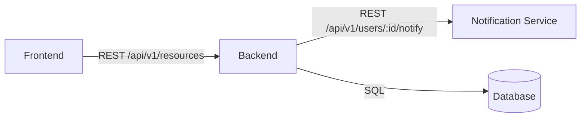

# API 设计模板（Phase 4 §2 API 输出）

> 把本模板复制为 `iteration-vault/04-architecture-and-api.md`，逐段填充。
>
> ⚠️ **本模板使用通用 REST 接口作示例数据**。PM 按实际项目协议（REST / GraphQL / gRPC / 自研消息）改造接口清单中的"协议"列。若项目有自定协议/RPC（如有），按项目实际协议填写；否则用标准 REST / gRPC / 事件。

---

```markdown
# API 设计 & 整理: <feature-name>

**版本**: <X.Y>
**日期**: <YYYY-MM-DD>
**对应 PRD**: iteration-vault/02-PRD.md
**对应架构**: iteration-vault/04-architecture-and-api.md
**对应 UX**: iteration-vault/05-interface-design.md

---

## 0. API 假设检查表（Karpathy "Think Before Coding"）

### 0.1 继承自架构的假设
从 04-architecture-and-api.md 引用：
- [假设 1]
- [假设 2]

### 0.2 API 新增假设表

| # | 假设 | 后果 | 验证方式 | 阻塞性 |
|---|---|---|---|---|
| 1 | 用户量 < 1000/QPS | per-user 100/min 够 | prod 监控 | 否 |
| 2 | 单条请求负载平均 200B | 不会撑爆传输上限 | 单元测试 | 否 |

### 0.3 刻意不做什么（Simplicity First）
- 不引入 [X gateway]，理由：QPS < 5k 不需要
- 不预留 [Y endpoint]，理由：YAGNI
- 不做 [Z 高级特性]，理由：MVP 不必

---

## 1. 新 API 设计（如本迭代涉及）

### 1.1 接口清单

| 接口 ID | 方法 | 路径 | 鉴权 | 描述 |
|---|---|---|---|---|
| resource.create | POST | /api/v1/resources | JWT | 创建资源 |
| resource.update | PATCH | /api/v1/resources/:id | JWT | 更新资源 |

### 1.2 详细契约

#### 1.2.1 `POST /api/v1/resources`
- **鉴权**: Bearer JWT
- **限流**: per-user 100/min
- **请求**:
  ```json
  {
    "name": "string",
    "attributes": { "...": "..." }
  }
  ```
- **响应 (201)**:
  ```json
  {
    "resource_id": "uuid",
    "status": "active",
    "data_source": "resources_table",
    "created_at": "..."
  }
  ```
- **错误**:
  - 400 `VALIDATION_INVALID_INPUT`
  - 409 `BUSINESS_DUPLICATE_RESOURCE`
  - 429 `RATE_LIMIT_EXCEEDED`

#### 1.2.2 `PATCH /api/v1/resources/:id`
- **鉴权**: Bearer JWT
- **限流**: per-user 100/min
- **请求**:
  ```json
  {
    "attributes": { "...": "..." }
  }
  ```
- **响应 (200)**:
  ```json
  {
    "resource_id": "uuid",
    "status": "active",
    "data_source": "resources_table",
    "updated_at": "..."
  }
  ```
- **错误**:
  - 400 `VALIDATION_INVALID_INPUT`
  - 404 `RESOURCE_NOT_FOUND`
  - 429 `RATE_LIMIT_EXCEEDED`

> 若项目有自定消息格式（如有），按项目实际信封字段在此补充契约（如 `message_id` / `sender` / `receiver` / `payload` / `timestamp` / `trace_id` 等）；否则用标准 REST / gRPC / 事件，无需此节。

### 1.3 通信协议适配（如适用）

| 接口 | 协议 | 信封字段（如有）|
|---|---|---|
| resource.create | REST | n/a |
| resource.update | REST | n/a |

### 1.4 限流 / 幂等 / 版本

- resource.create: 100/min per-user, 支持 Idempotency-Key, v1
- resource.update: 100/min per-user, v1

### 1.5 可选合规字段嵌入（如项目有此要求）

| 接口 | confidence | human_review_required | data_source |
|---|---|---|---|
| resource.create | n/a（非 LLM）| n/a（低风险）| ✅ resources_table |
| llm.suggest | ✅ 必填 | ✅ 必填（高风险）| ✅ model_v3 |

---

## 2. 存量审计报告

### 2.1 扫描范围
- 目录: `src/api/`（及项目实际接口/消息处理目录）
- OpenAPI 文件: `openapi/v1.yaml`
- 项目自定协议 topics（如有）: 从项目配置加载
- 扫描接口总数: [N]
- 扫描耗时: [X] min

### 2.2 命名一致性

| 接口 | 当前命名 | 推荐命名 | 严重度 | 本迭代修复？|
|---|---|---|---|---|
| /api/v1/getUserOrders | 动词中心 | /api/v1/users/:id/orders | 🟡 major | 否（Surgical Changes，进 backlog）|

### 2.3 重复检测

| 候选 1 | 候选 2 | 相似度 | 建议 |
|---|---|---|---|
| /orders + /shop/orders | 99% | 合并到 /orders |

### 2.4 项目自定协议（如有）合规

| 接口 | 缺失字段 | 严重度 | 优先级 |
|---|---|---|---|
| user.notify | confidence | 🔴 critical | 本迭代修 |
| resource.sync | trace_id | 🟡 major | 进 backlog |

### 2.5 调用关系图



本次改动影响：resource API 新增 `suggestion_id` 字段 → 下游 Notification Service 受影响。

### 2.6 废弃候选

| 接口 | 最后调用 | deprecate 日期 | 真删日期 | 替代 |
|---|---|---|---|---|
| /api/v0/resources | 2026-01-15 | 2026-06-01 | 2026-12-01 | /api/v1/resources |

---

## 3. 文档产物

- **3.1 OpenAPI YAML**: `iteration-vault/04-api-spec.yaml`
- **3.2 Postman collection**: `iteration-vault/04-api-postman.json`
- **3.3 人类可读 API.md**: `iteration-vault/04-api.md`
- **3.4 api-registry.md diff**: +2 新增 / 改 1 / deprecated 1

---

## 4. 三角自检表

| 维度 | 状态 | 备注 |
|---|---|---|
| Karpathy Think Before Coding（≥ 3 假设）| ✅ | 假设清单见 §0 |
| Karpathy Simplicity First（无顺手 endpoint）| ✅ | 见 §0.3 |
| Karpathy Surgical Changes（只改本迭代必需）| ✅ | 命名问题进 backlog 不顺手改 |
| Karpathy Goal-Driven（每接口可测 AC）| ✅ | 见 §1.2 错误码 + schema |
| 合规：业务规则不硬编码（如有要求）| ✅ | 走 business_rule 表 |
| 合规：人工保留点字段（如有要求）| ✅ | 见 §1.5 |
| 合规：confidence + data_source（如有要求）| ✅ | 见 §1.5 |
| 自定消息格式信封完整（如项目有此协议）| ✅ | 见 §1.3 |
| RFC 9457 错误格式 | ✅ | 见 §1.2 |
| 版本策略一致（URL path）| ✅ | v1 |
| 限流策略一致 | ✅ | 默认值 + 显式覆盖 |
| 幂等性策略到位 | ✅ | Idempotency-Key + message_id |
| 废弃流程到位 | ✅ | deprecate → 6 月 → 真删 |
| Contract test 可跑 | ✅ | OpenAPI YAML + Postman |

任一 ❌ → 修，2 次仍 ❌ → R1 升级。

---

## 5. 给 autonomous-decisions.md 的摘要

```
[Phase 4 §2 API 摘要]
- 本迭代新增/修改 API: 2 个
- 存量审计: 扫 [N] 个，发现 [M] 个命名不一致 / [K] 个废弃候选
- 自定协议合规（如有）: [X/X] 通过
- 注册表更新: +2 / 改 1 / deprecated 1
- GAN 跑了 [N] 轮，PIVOT [yes/no]，PASS at round-[X]
- 关键决定: [一条 PM 关注的]
```
```
