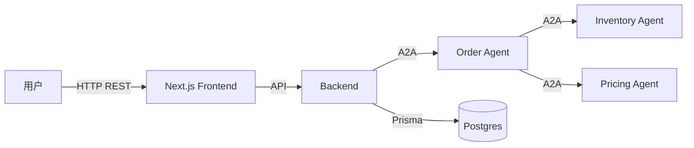

# INDEX.md 模板（< 100 行硬上限）

> Phase 5.9 文档压缩自动生成 `iteration-vault/INDEX.md` 按本模板。
>
> ⚠️ **本模板技术栈和调用图使用 A2A 协议作示例**。PM 按实际项目技术栈和通信方式改造。

---

```markdown
# Iteration INDEX (Knowledge Map)

> "**地图不是摘要**"——本文件保留信息索引，不复制内容。
> 后续 Phase 6+ 必读此文件而非全量设计文档（token 节省 ~70%）。

---

## 项目概述（1-2 句）

<feature-name>: <一句话功能描述>

---

## 技术栈（一行）

<项目技术栈，例：Next.js + Postgres + Sentry>

---

## 知识地图

| 类型 | 位置 | 行号 / 段 |
|---|---|---|
| 需求澄清 | 01-clarified-requirement.md | 全文 |
| 用户研究（画像 + 痛点 + 旅程） | 01.5-user-research.md | §2/§3/§4 |
| PRD（背景/目标/用户故事/AC/风险）| 02-PRD.md | 全文（§1-§10）|
| brainstorm（方案候选 + 收敛）| 02.5-brainstorm-converge.md | §3-§4 |
| 影响面分析 | 03-impact-analysis.md | 全文 |
| 架构（数据流 + 模块 + DB + 选型）| 04-architecture.md | §1/§3/§4 |
| API 设计 + 存量审计 | 04.5-api-design.md | §1/§2/§3 |
| API spec YAML | 04.5-api-spec.yaml | machine format |
| UX flow（旅程 + IA + 线框）| 05a-ux-design.md | §1-§4 |
| UI Spec（页面 + 组件）| 05b-ui-spec.md | 全文 |
| 任务分解（带 AC + status）| 06-task-breakdown.md | 全文 |
| 自治决策（持续追加）| autonomous-decisions.md | 时序 |
| GAN trace（按 phase）| <phase>-gan/trace.md | 按 phase 查 |
| 红线 escalation | ESCALATION-R*.md | 如有 |
| Checkpoint | checkpoints/ | 决策回放用 |

---

## 核心约束（5 条速查）

1. **r4 哲学 1-3 维**必落实（confidence / human_review_required / data_source）— 第 4 维已废除
2. **项目业务协议（如有）信封 9 字段**强制（agent↔agent 通信）
3. **RFC 9457 错误格式** + 业务码前缀（AUTH_/VALIDATION_/.../PROTOCOL_）
4. **7 Quality Redlines**（详见 RULES.md）
5. **Karpathy 4 原则**：Think / Simplicity / Surgical / Goal-Driven

---

## 本次迭代特殊点

- **API 改动**: <N> 个新 endpoint，<M> 个业务协议主题（详见 04.5-api-design.md）
- **UI 改动**: <X> 个新页面，<Y> 个修改页面（详见 05b-ui-spec.md）
- **DB 改动**: <Z> 个新表 / <W> 个字段变更（详见 04-architecture.md §3）
- **Phase 6 估算**: <T> 个 code task（<U> 含前端，<V> 机械）
- **GAN 任务数**: <K>（PRD/架构/4.5/5a/6/11 + 7 实施 + autopilot 种子）
- **关键风险**: <一句话>

---

## 调用关系（mermaid 简版）



---

## Phase 6+ 加载指南

后续每个 phase 启动时必读：

1. **本文件 INDEX.md** — 知道找什么去哪找
2. **RULES.md** — 知道什么不能做
3. **当前 phase 直接相关的 1-2 份原文档**（不读全量）

例：Phase 7 代码任务 → 读 INDEX + RULES + 06-task-breakdown.md 当前 task 段 + （如涉及 API）04.5-api-spec.yaml 当前 endpoint 段。

---

**生成于**: <YYYY-MM-DD HH:mm>
**生成器**: Phase 5.9 compress
**文件总数**: <N>
**本文件行数**: <X> / 100
```
